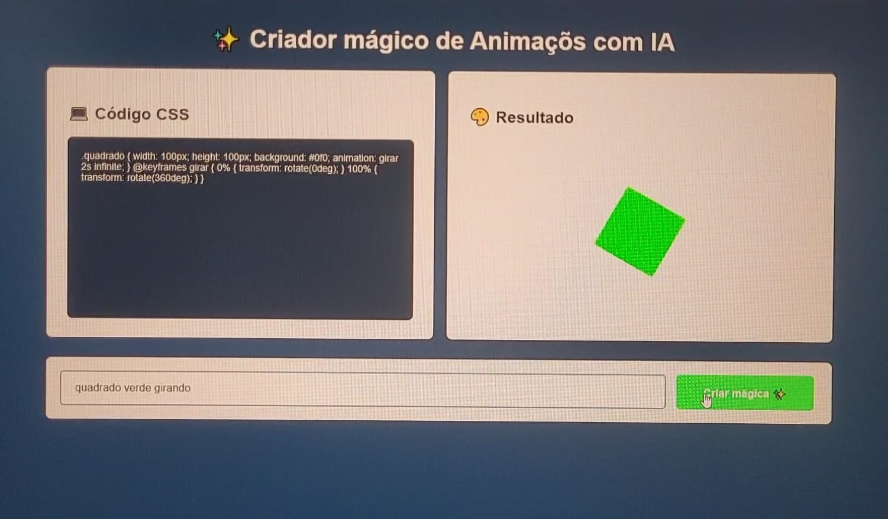

# ✨ Criador Mágico de Animações com IA  

Este projeto é uma aplicação web que permite ao usuário **descrever uma animação em texto**, e automaticamente o sistema gera:  

- O **código CSS** correspondente.  
- A **visualização da animação em tempo real**.  

Tudo isso utilizando integração com um **webhook de Inteligência Artificial**. 🚀 

---

## ⚠️ Importante
utilizei a versão **gratuita do n8n** para criar o webhook de integração com IA.  
Atualmente não tenho mais acesso a esse recurso, portanto não consigo disponibilizar o link pronto.  
Se quiser testar, será necessário criar o seu próprio webhook no n8n (ou outra plataforma semelhante). 

---

## 📌 Funcionalidades
- Campo de input para descrição da animação desejada.  
- Geração automática de código CSS com base na descrição.  
- Área de pré-visualização para exibir a animação gerada.  
- Interface simples, intuitiva e responsiva.  

---

## 🛠️ Tecnologias utilizadas
- **HTML5** → estrutura da aplicação  
- **CSS3** → estilização e layout  
- **JavaScript (ES6+)** → lógica, integração com webhook e manipulação do DOM  

---

## 🚀 Como usar
1. Clone este repositório:
   ```bash
   git clone https://github.com/BrunoCamargoDev/animacoes-com-ia.git
   ```
2. Abra o arquivo `index.html` em seu navegador

3. No arquivo `scripts.js` substitua o valor da variável webhoock pelo link do **seu webhook de IA**:
    ``` bash
    let webhoock = "seu-link-do-webhoock"
    ```
4. Digite a descrição da animação no campo de input e clique em **"Criar mágica ✨"**.

5. Veja o código CSS gerado e o resultado da animação na tela.

## 📷 Demonstração


## 📚 Observação

Este projeto foi desenvolvido durante a Imersão Programador do Futuro - DevClub 🧑‍💻
